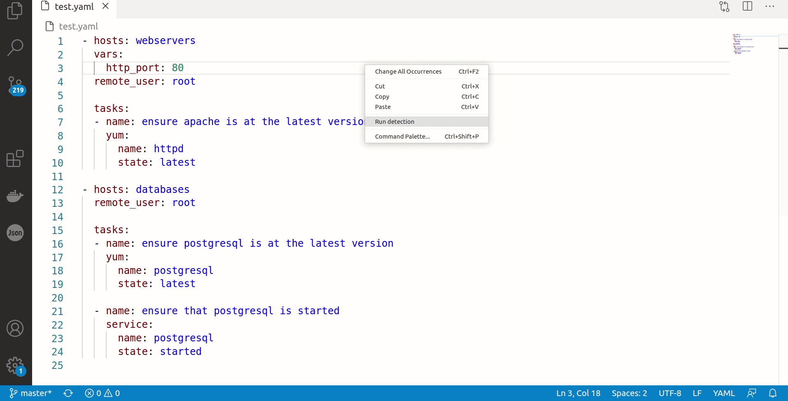

# radon-defect-prediction-plugin README

A Visual Studio Code plugin for the RADON-h2020 Defect Predictor.

## How to use

Right-click on the YAML file to analyse, then click on *Run detection*.

## Requirements

* The extension only requires an internet connection to call the APIs.

## Release Notes

See [CHANGELOG](CHANGELOG.md)